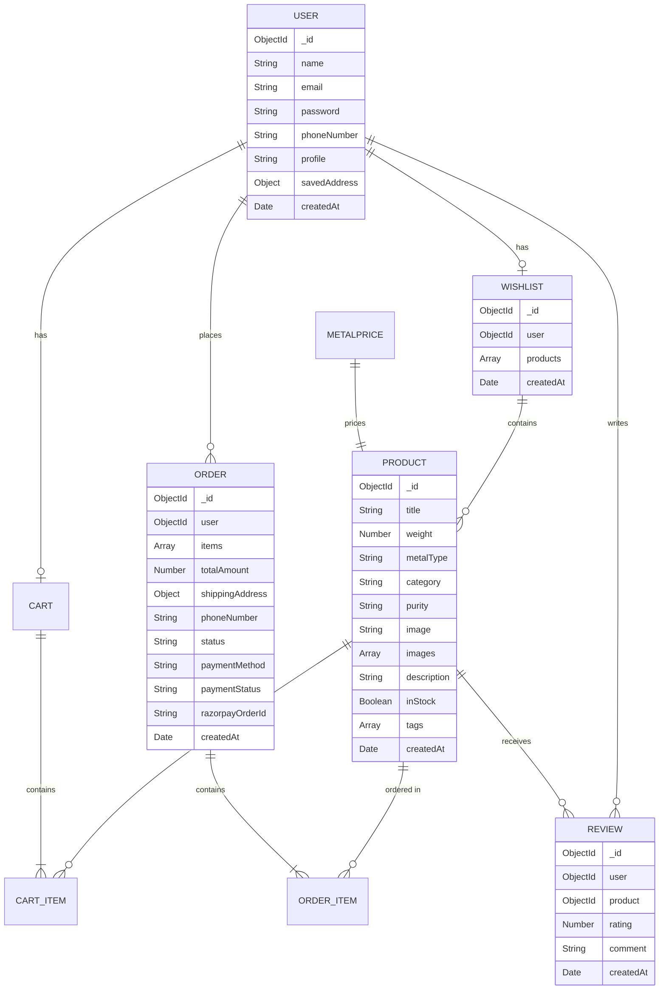

# 🚀 Amit Jewellers — Full-Stack E-Commerce Transformation Roadmap

## Project Audit: What You Already Have (and What's Missing)

### ✅ Current Strengths (Solid Foundation)

| Area | What You've Built |
|------|-------------------|
| **Auth** | JWT-based user + admin auth with separate secrets, bcrypt password hashing |
| **Products** | CRUD with admin-only write access, dynamic pricing from gold API |
| **Cart** | Full cart flow — add, update quantity, remove, clear |
| **Orders** | Order creation from cart, order history, admin status management |
| **Admin** | Separate admin login/signup, carousel + product management, price refresh |
| **Live Pricing** | Real-time gold price fetched via external API, stored in MongoDB |
| **Frontend** | React 19 + Vite + Tailwind, react-router-dom, axios with interceptors |
| **Deployment** | Already live on Render at `amit-jewellers.onrender.com` |

### 🔴 Critical Gaps (What's Blocking "Placement-Ready")

| Gap | Impact | Priority |
|-----|--------|----------|
| No input validation/sanitization (backend) | Security vulnerability — instant reject in code reviews | 🔴 P0 |
| No error boundary or toast notifications (frontend) | Poor UX — users see blank screens on errors | 🔴 P0 |
| No product categories/filters | Can't browse by type — unusable as real e-commerce | 🔴 P0 |
| No wishlist functionality | Missing standard e-commerce feature | 🟡 P1 |
| No product reviews/ratings | No social proof — key differentiator for interviews | 🟡 P1 |
| No payment integration | Orders placed without payment — not realistic | 🟡 P1 |
| No pagination on product listing | Performance degrades with more products | 🟡 P1 |
| No image upload (using URL strings) | Not production-grade — needs Cloudinary/S3 | 🟡 P1 |
| `formatPrice()` duplicated in 5+ files | Code smell — violates DRY principle | 🟢 P2 |
| Dead code in `backend/index.js` (lines 65-92) | Unprofessional — remove before showing to interviewers | 🟢 P2 |
| No loading skeletons on Home page | UX feels janky without feedback | 🟢 P2 |
| `nodemon` in production `dependencies` | Should be in `devDependencies` | 🟢 P2 |
| No `timestamps` on User/Product models | Can't track when data was created | 🟢 P2 |
| User schema has no address field | Forces re-entry at every checkout | 🟢 P2 |
| No 404 page | Broken routes show blank screen | 🟢 P2 |
| No SEO meta tags | Site won't rank, looks incomplete | 🟢 P2 |

---

## Phase 1: Code Quality & Security Hardening (Day 1-2)

> **Goal:** Fix the things that would get your project rejected in a code review.

### 1.1 Backend Input Validation with `express-validator`

```bash
cd backend
npm install express-validator
```

**Example: Validate user signup** — create `backend/validators/userValidator.js`:

```js
const { body } = require("express-validator");

exports.signupRules = [
  body("name").trim().notEmpty().withMessage("Name is required"),
  body("email").isEmail().normalizeEmail().withMessage("Valid email required"),
  body("password")
    .isLength({ min: 6 })
    .withMessage("Password must be at least 6 characters"),
  body("phoneNumber")
    .matches(/^[6-9]\d{9}$/)
    .withMessage("Valid 10-digit Indian phone number required"),
];

exports.loginRules = [
  body("email").isEmail().normalizeEmail(),
  body("password").notEmpty(),
];
```

**Validation middleware** — create `backend/middlewares/validate.js`:

```js
const { validationResult } = require("express-validator");

module.exports = (req, res, next) => {
  const errors = validationResult(req);
  if (!errors.isEmpty()) {
    return res.status(422).json({ errors: errors.array() });
  }
  next();
};
```

**Usage in routes:**

```js
const { signupRules } = require("../validators/userValidator");
const validate = require("../middlewares/validate");

router.post("/signup", signupRules, validate, addUser);
```

### 1.2 Clean Dead Code & Fix Package Issues

- **Remove lines 65-92** from [index.js](file:///c:/Users/ujjwa/OneDrive/Attachments/Desktop/Amit_Jewellers/backend/index.js) (commented-out dice/ig routes)
- **Move `nodemon`** from `dependencies` to `devDependencies` in backend `package.json`
- **Change start script** for production: `"start": "node index.js"` and add `"dev": "nodemon index.js"`
- **Add `timestamps: true`** to User and Product schemas

### 1.3 Create Shared Utility for `formatPrice`

Create `frontend/src/utils/formatPrice.js`:

```js
export const formatPrice = (value) => {
  const num = Number(value);
  if (!Number.isFinite(num) || num <= 0) return "—";
  return new Intl.NumberFormat("en-IN", {
    style: "currency",
    currency: "INR",
    maximumFractionDigits: 0,
  }).format(num);
};
```

Then replace all 5+ duplicate `formatPrice` functions across Cart.jsx, Checkout.jsx, Product.jsx, ProductCard.jsx, Orders.jsx with:

```js
import { formatPrice } from "../utils/formatPrice";
```

### 1.4 Global Error Boundary

Create `frontend/src/components/ErrorBoundary.jsx`:

```jsx
import React from "react";

class ErrorBoundary extends React.Component {
  state = { hasError: false };

  static getDerivedStateFromError() {
    return { hasError: true };
  }

  componentDidCatch(error, info) {
    console.error("ErrorBoundary caught:", error, info);
  }

  render() {
    if (this.state.hasError) {
      return (
        <div className="min-h-screen flex flex-col items-center justify-center">
          <h1 className="text-3xl font-bold text-red-600 mb-4">
            Something went wrong
          </h1>
          <button
            onClick={() => window.location.reload()}
            className="bg-yellow-500 text-white px-6 py-2 rounded-lg"
          >
            Reload Page
          </button>
        </div>
      );
    }
    return this.props.children;
  }
}

export default ErrorBoundary;
```

### 1.5 Toast Notification System

```bash
cd frontend
npm install react-hot-toast
```

Replace all `alert()` and `confirm()` calls with toast notifications:

```jsx
// In main.jsx
import { Toaster } from "react-hot-toast";

// In components
import toast from "react-hot-toast";
toast.success("Added to cart!");
toast.error("Failed to place order");
```

---

## Phase 2: E-Commerce Core Features (Day 3-5)

### 2.1 Product Categories & Filters

**Backend — Update Product Schema:**

```js
// backend/models/Product.js
const productSchema = new mongoose.Schema({
  title: { type: String, required: true },
  weight: { type: Number, required: true },
  metalType: { type: String, enum: ["gold", "silver"], required: true },
  category: {
    type: String,
    enum: ["ring", "necklace", "earring", "bracelet", "pendant", "chain", "bangle", "other"],
    required: true,
  },
  purity: { type: String, enum: ["24K", "22K", "18K", "sterling"], default: "22K" },
  image: { type: String, required: true },
  images: [{ type: String }], // Multiple images
  description: { type: String, required: true },
  inStock: { type: Boolean, default: true },
  tags: [{ type: String }], // "bestseller", "new-arrival", "trending"
}, { timestamps: true });

productSchema.index({ title: "text", description: "text", tags: "text" }); // Full-text search
```

**Backend — Filter API** in `productCrud.js`:

```js
const getProducts = async (req, res) => {
  try {
    const { category, metalType, minWeight, maxWeight, sort, search, page = 1, limit = 12 } = req.query;
    
    const filter = {};
    if (category) filter.category = category;
    if (metalType) filter.metalType = metalType;
    if (minWeight || maxWeight) {
      filter.weight = {};
      if (minWeight) filter.weight.$gte = Number(minWeight);
      if (maxWeight) filter.weight.$lte = Number(maxWeight);
    }
    if (search) filter.$text = { $search: search };

    const skip = (Number(page) - 1) * Number(limit);
    
    let sortObj = { createdAt: -1 };
    if (sort === "price-asc") sortObj = { weight: 1 };
    if (sort === "price-desc") sortObj = { weight: -1 };
    if (sort === "newest") sortObj = { createdAt: -1 };

    const [products, total] = await Promise.all([
      Product.find(filter).sort(sortObj).skip(skip).limit(Number(limit)),
      Product.countDocuments(filter),
    ]);

    // ... price calculation logic ...

    res.json({
      products: priced,
      pagination: {
        page: Number(page),
        limit: Number(limit),
        total,
        pages: Math.ceil(total / Number(limit)),
      },
    });
  } catch (error) {
    res.status(500).json({ error: error.message });
  }
};
```

**Frontend — Filter Sidebar Component:**

Create `frontend/src/components/FilterSidebar.jsx` with:
- Category checkboxes (Ring, Necklace, Earring, etc.)
- Metal type toggle (Gold / Silver)
- Weight range slider
- Sort dropdown (Price Low→High, Newest, etc.)
- "Clear All Filters" button

### 2.2 Wishlist Feature

**Backend Model — `backend/models/Wishlist.js`:**

```js
const mongoose = require("mongoose");

const wishlistSchema = new mongoose.Schema({
  user: { type: mongoose.Schema.Types.ObjectId, ref: "User", required: true, unique: true },
  products: [{ type: mongoose.Schema.Types.ObjectId, ref: "Product" }],
}, { timestamps: true });

module.exports = mongoose.model("Wishlist", wishlistSchema);
```

**API Endpoints:**

| Method | Endpoint | Description |
|--------|----------|-------------|
| GET | `/api/wishlist` | Get user's wishlist |
| POST | `/api/wishlist/add` | Add product to wishlist |
| DELETE | `/api/wishlist/remove/:productId` | Remove from wishlist |

### 2.3 Product Reviews & Ratings

**Backend Model — `backend/models/Review.js`:**

```js
const mongoose = require("mongoose");

const reviewSchema = new mongoose.Schema({
  user: { type: mongoose.Schema.Types.ObjectId, ref: "User", required: true },
  product: { type: mongoose.Schema.Types.ObjectId, ref: "Product", required: true },
  rating: { type: Number, required: true, min: 1, max: 5 },
  comment: { type: String, required: true, maxlength: 500 },
}, { timestamps: true });

// One review per user per product
reviewSchema.index({ user: 1, product: 1 }, { unique: true });

module.exports = mongoose.model("Review", reviewSchema);
```

**API Endpoints:**

| Method | Endpoint | Description |
|--------|----------|-------------|
| GET | `/api/reviews/:productId` | Get all reviews for a product |
| POST | `/api/reviews` | Add a review (auth required) |
| PUT | `/api/reviews/:id` | Update own review |
| DELETE | `/api/reviews/:id` | Delete own review |

### 2.4 Image Upload with Cloudinary

```bash
cd backend
npm install multer cloudinary multer-storage-cloudinary
```

Create `backend/utils/cloudinary.js`:

```js
const cloudinary = require("cloudinary").v2;
const { CloudinaryStorage } = require("multer-storage-cloudinary");
const multer = require("multer");

cloudinary.config({
  cloud_name: process.env.CLOUDINARY_CLOUD_NAME,
  api_key: process.env.CLOUDINARY_API_KEY,
  api_secret: process.env.CLOUDINARY_API_SECRET,
});

const storage = new CloudinaryStorage({
  cloudinary,
  params: {
    folder: "amit-jewellers",
    allowed_formats: ["jpg", "jpeg", "png", "webp"],
    transformation: [{ width: 800, height: 800, crop: "limit", quality: "auto" }],
  },
});

const upload = multer({ storage, limits: { fileSize: 5 * 1024 * 1024 } });

module.exports = { cloudinary, upload };
```

---

## Phase 3: Payment Integration & UX Polish (Day 5-7)

### 3.1 Razorpay Payment Integration (Indian Payments)

```bash
cd backend
npm install razorpay crypto
```

**Backend — Create `backend/routers/paymentRoutes.js`:**

```js
const express = require("express");
const Razorpay = require("razorpay");
const crypto = require("crypto");
const verifyUser = require("../middlewares/verifyUser");

const router = express.Router();

const razorpay = new Razorpay({
  key_id: process.env.RAZORPAY_KEY_ID,
  key_secret: process.env.RAZORPAY_KEY_SECRET,
});

// Create payment order
router.post("/create-order", verifyUser, async (req, res) => {
  const { amount } = req.body; // amount in paise
  const options = {
    amount: amount * 100,
    currency: "INR",
    receipt: `receipt_${Date.now()}`,
  };
  const order = await razorpay.orders.create(options);
  res.json(order);
});

// Verify payment
router.post("/verify", verifyUser, async (req, res) => {
  const { razorpay_order_id, razorpay_payment_id, razorpay_signature } = req.body;
  const sign = razorpay_order_id + "|" + razorpay_payment_id;
  const expectedSign = crypto
    .createHmac("sha256", process.env.RAZORPAY_KEY_SECRET)
    .update(sign)
    .digest("hex");

  if (razorpay_signature === expectedSign) {
    res.json({ verified: true });
  } else {
    res.status(400).json({ verified: false });
  }
});

module.exports = router;
```

> [!TIP]
> For testing, use Razorpay's **test mode** keys. No real money is charged. This is the standard approach for placement projects.

### 3.2 Enhanced Checkout Flow

Update Order Schema to track payment:

```js
const orderSchema = new mongoose.Schema({
  // ... existing fields ...
  paymentMethod: {
    type: String,
    enum: ["razorpay", "cod"],
    default: "cod",
  },
  paymentStatus: {
    type: String,
    enum: ["pending", "paid", "failed", "refunded"],
    default: "pending",
  },
  razorpayOrderId: String,
  razorpayPaymentId: String,
}, { timestamps: true });
```

### 3.3 Mobile-First Responsive Navbar

The current header stacks poorly on mobile. Replace with a hamburger menu:

```jsx
// Key changes in Header.jsx
const [mobileMenuOpen, setMobileMenuOpen] = useState(false);

// Add hamburger button for mobile
<button
  className="md:hidden"
  onClick={() => setMobileMenuOpen(!mobileMenuOpen)}
>
  {mobileMenuOpen ? "✕" : "☰"}
</button>

// Slide-out drawer for mobile
<div className={`fixed inset-0 z-50 md:hidden transform transition-transform ${
  mobileMenuOpen ? "translate-x-0" : "-translate-x-full"
}`}>
  {/* Navigation links */}
</div>
```

### 3.4 Add Missing Pages

| Page | Route | Purpose |
|------|-------|---------|
| **404 Not Found** | `*` | Catch-all for invalid routes |
| **User Profile** | `/profile` | View/edit profile, saved addresses |
| **About Us** | `/about` | Store history, trust-building |
| **Contact** | `/contact` | Contact form (sends email via backend) |

---

## Phase 4: Advanced Features to Stand Out (Day 7-9)

### 4.1 Real-Time Gold Price Ticker (Already Partially Built)

Enhance the existing gold price display with:
- Auto-refresh every 5 minutes
- Price change indicator (↑ green / ↓ red)
- Historical price graph (last 7 days) using `recharts`

```bash
cd frontend
npm install recharts
```

### 4.2 Advanced Search with Debounce & Autocomplete

Create `frontend/src/hooks/useDebounce.js`:

```js
import { useState, useEffect } from "react";

export function useDebounce(value, delay = 300) {
  const [debounced, setDebounced] = useState(value);
  useEffect(() => {
    const timer = setTimeout(() => setDebounced(value), delay);
    return () => clearTimeout(timer);
  }, [value, delay]);
  return debounced;
}
```

### 4.3 Order Tracking with Timeline UI

```jsx
const OrderTimeline = ({ status }) => {
  const steps = ["pending", "confirmed", "processing", "shipped", "delivered"];
  const currentIndex = steps.indexOf(status);

  return (
    <div className="flex items-center gap-2">
      {steps.map((step, i) => (
        <div key={step} className="flex items-center">
          <div className={`w-8 h-8 rounded-full flex items-center justify-center text-sm font-bold ${
            i <= currentIndex
              ? "bg-green-500 text-white"
              : "bg-gray-200 text-gray-500"
          }`}>
            {i < currentIndex ? "✓" : i + 1}
          </div>
          {i < steps.length - 1 && (
            <div className={`w-12 h-1 ${
              i < currentIndex ? "bg-green-500" : "bg-gray-200"
            }`} />
          )}
        </div>
      ))}
    </div>
  );
};
```

### 4.4 Admin Dashboard Enhancements

- **Revenue chart** — daily/weekly/monthly sales using `recharts`
- **Order management** — filter by status, search by customer
- **Low stock alerts** (if inventory tracking added)
- **Customer list** with order count

### 4.5 Email Notifications (Bonus)

```bash
cd backend
npm install nodemailer
```

Send emails on:
- User signup (welcome email)
- Order placed (confirmation)
- Order status change (shipping update)

---

## Complete API Reference

### Auth APIs

| Method | Endpoint | Auth | Description |
|--------|----------|------|-------------|
| POST | `/api/user/signup` | ❌ | Register new user |
| POST | `/api/user/login` | ❌ | User login |
| GET | `/api/user` | 🔑 User | Get user profile |
| PUT | `/api/user/update` | 🔑 User | **[NEW]** Update profile |
| POST | `/api/admin/signup` | 🔑 Admin | Register admin |
| POST | `/api/admin/login` | ❌ | Admin login |
| GET | `/api/admin` | 🔑 Admin | Get admin profile |

### Product APIs

| Method | Endpoint | Auth | Description |
|--------|----------|------|-------------|
| GET | `/api/products?category=ring&metalType=gold&page=1&limit=12` | ❌ | **[ENHANCED]** List with filters + pagination |
| GET | `/api/products/:id` | ❌ | Product detail |
| POST | `/api/products/add` | 🔑 Admin | Create product |
| PUT | `/api/products/update/:id` | 🔑 Admin | Update product |
| DELETE | `/api/products/delete/:id` | 🔑 Admin | Delete product |

### Cart APIs (existing — no changes needed)

| Method | Endpoint | Auth | Description |
|--------|----------|------|-------------|
| GET | `/api/cart` | 🔑 User | Get cart |
| POST | `/api/cart/add` | 🔑 User | Add to cart |
| PUT | `/api/cart/update/:itemId` | 🔑 User | Update quantity |
| DELETE | `/api/cart/remove/:itemId` | 🔑 User | Remove item |
| DELETE | `/api/cart/clear` | 🔑 User | Clear cart |

### Order APIs

| Method | Endpoint | Auth | Description |
|--------|----------|------|-------------|
| POST | `/api/orders/create` | 🔑 User | Place order |
| GET | `/api/orders` | 🔑 User | My orders |
| GET | `/api/orders/:id` | 🔑 User | Order detail |
| GET | `/api/orders/admin/all` | 🔑 Admin | All orders |
| PUT | `/api/orders/admin/update/:id` | 🔑 Admin | Update status |

### New APIs

| Method | Endpoint | Auth | Description |
|--------|----------|------|-------------|
| GET | `/api/wishlist` | 🔑 User | **[NEW]** Get wishlist |
| POST | `/api/wishlist/add` | 🔑 User | **[NEW]** Add to wishlist |
| DELETE | `/api/wishlist/remove/:productId` | 🔑 User | **[NEW]** Remove from wishlist |
| GET | `/api/reviews/:productId` | ❌ | **[NEW]** Get product reviews |
| POST | `/api/reviews` | 🔑 User | **[NEW]** Add review |
| PUT | `/api/reviews/:id` | 🔑 User | **[NEW]** Update review |
| DELETE | `/api/reviews/:id` | 🔑 User | **[NEW]** Delete review |
| POST | `/api/payment/create-order` | 🔑 User | **[NEW]** Create Razorpay order |
| POST | `/api/payment/verify` | 🔑 User | **[NEW]** Verify payment |
| POST | `/api/products/upload-image` | 🔑 Admin | **[NEW]** Upload image |

---

## Enhanced Database Schemas



---

## Recommended Folder Structure

```
Amit_Jewellers/
├── backend/
│   ├── config/
│   │   └── db.js                    # MongoDB connection logic (extract from index.js)
│   ├── controllers/                 # Rename "crud" → "controllers" (industry standard)
│   │   ├── authController.js
│   │   ├── productController.js
│   │   ├── cartController.js
│   │   ├── orderController.js
│   │   ├── reviewController.js
│   │   ├── wishlistController.js
│   │   └── paymentController.js
│   ├── middlewares/
│   │   ├── verifyUser.js
│   │   ├── verifyAdmin.js
│   │   ├── validate.js              # [NEW] express-validator runner
│   │   └── errorHandler.js          # [NEW] global error handler
│   ├── models/
│   │   ├── User.js
│   │   ├── Product.js
│   │   ├── Cart.js
│   │   ├── Order.js
│   │   ├── Review.js                # [NEW]
│   │   ├── Wishlist.js              # [NEW]
│   │   └── MetalPrice.js
│   ├── routers/
│   │   ├── authRoutes.js
│   │   ├── productRoutes.js
│   │   ├── cartRoutes.js
│   │   ├── orderRoutes.js
│   │   ├── reviewRoutes.js          # [NEW]
│   │   ├── wishlistRoutes.js        # [NEW]
│   │   ├── paymentRoutes.js         # [NEW]
│   │   └── priceRoutes.js
│   ├── utils/
│   │   ├── jwt.js
│   │   ├── metalService.js
│   │   └── cloudinary.js            # [NEW]
│   ├── validators/                   # [NEW]
│   │   ├── userValidator.js
│   │   ├── productValidator.js
│   │   └── orderValidator.js
│   ├── .env
│   ├── index.js
│   └── package.json
│
├── frontend/
│   ├── public/
│   │   ├── logo.png
│   │   └── video/
│   ├── src/
│   │   ├── components/
│   │   │   ├── common/               # [NEW] Shared components
│   │   │   │   ├── Loader.jsx
│   │   │   │   ├── EmptyState.jsx
│   │   │   │   └── Breadcrumb.jsx
│   │   │   ├── layout/               # [NEW]
│   │   │   │   ├── Header.jsx
│   │   │   │   ├── Footer.jsx
│   │   │   │   └── MobileDrawer.jsx
│   │   │   ├── product/              # [NEW]
│   │   │   │   ├── ProductCard.jsx
│   │   │   │   ├── FilterSidebar.jsx
│   │   │   │   ├── ReviewSection.jsx
│   │   │   │   └── StarRating.jsx
│   │   │   ├── ErrorBoundary.jsx
│   │   │   ├── RequireAdmin.jsx
│   │   │   └── SignOutButton.jsx
│   │   ├── context/                   # [NEW] React Context for global state
│   │   │   ├── AuthContext.jsx
│   │   │   └── CartContext.jsx
│   │   ├── hooks/                     # [NEW] Custom hooks
│   │   │   ├── useDebounce.js
│   │   │   └── useAuth.js
│   │   ├── pages/
│   │   │   ├── Home.jsx
│   │   │   ├── Product.jsx
│   │   │   ├── Cart.jsx
│   │   │   ├── Checkout.jsx
│   │   │   ├── Login.jsx
│   │   │   ├── Signup.jsx
│   │   │   ├── Orders.jsx
│   │   │   ├── OrderSuccess.jsx
│   │   │   ├── Profile.jsx           # [NEW]
│   │   │   ├── Wishlist.jsx          # [NEW]
│   │   │   ├── About.jsx             # [NEW]
│   │   │   ├── NotFound.jsx          # [NEW]
│   │   │   ├── Admin.jsx
│   │   │   ├── AdminLogin.jsx
│   │   │   └── Adminsignup.jsx
│   │   ├── utils/
│   │   │   └── formatPrice.js        # [NEW] Shared utility
│   │   ├── helper/
│   │   │   ├── auth.js
│   │   │   └── axiosInstance.js
│   │   ├── App.jsx
│   │   ├── App.css
│   │   ├── index.css
│   │   └── main.jsx
│   ├── .env
│   └── package.json
│
├── .gitignore
├── package.json
└── README.md                         # [ENHANCE] Add setup instructions, screenshots, tech stack
```

> [!IMPORTANT]
> **Don't rename `crud/` to `controllers/` all at once.** Do it file-by-file and update the imports in routers as you go. Otherwise you'll break everything.

---

## Performance Optimizations

### Image Optimization
```jsx
// Lazy loading + WebP format via Cloudinary transformations

```

### Code Splitting with React.lazy
```jsx
// In App.jsx — load heavy pages on demand
const Admin = React.lazy(() => import("./pages/Admin"));
const Checkout = React.lazy(() => import("./pages/Checkout"));

// Wrap routes in Suspense
<Suspense fallback={<Loader />}>
  <Route path="/admin" element={<Admin />} />
</Suspense>
```

### Backend Optimizations
- **Add MongoDB indexes** on frequently queried fields (`metalType`, `category`, `user`)
- **Implement Redis caching** for metal prices (they don't change every second)
- **Use `lean()`** on read-only queries for 3-5x faster responses
- **Add compression middleware**: `npm install compression` → `app.use(compression())`
- **Rate limiting**: `npm install express-rate-limit` (protect login endpoints)

---

## Mobile Responsiveness Checklist

| Component | Current Issue | Fix |
|-----------|--------------|-----|
| **Header** | Search bar + nav items overflow on small screens | Hamburger menu + mobile drawer |
| **Product Grid** | Fixed `w-64` cards — can't fill mobile width | Use `grid-cols-1 sm:grid-cols-2 lg:grid-cols-3` with `w-full` |
| **Carousel** | `h-[90vh]` is too tall on mobile | Use `h-[50vh] md:h-[70vh] lg:h-[90vh]` |
| **Footer** | Image + text overflow on narrow screens | Stack vertically on mobile, reduce image size |
| **Cart** | Good — already responsive ✅ | — |
| **Checkout form** | Good — already uses grid ✅ | — |
| **Product detail** | Image takes full width on mobile | Add `max-h-[50vh]` on mobile |

---

## Deployment Strategy

### Current Setup (Keep)
- **Frontend + Backend**: Render (monorepo with separate services)

### Recommended Production Setup

```
┌──────────────────────┐     ┌──────────────────────┐
│   Frontend (Vercel)  │────▶│  Backend (Render)     │
│   - Vite React App   │     │  - Express + Node.js  │
│   - CDN for assets   │     │  - MongoDB Atlas      │
│   - Auto SSL         │     │  - Cloudinary (images)│
└──────────────────────┘     └──────────────────────┘
```

| Component | Service | Why |
|-----------|---------|-----|
| Frontend | **Vercel** or **Netlify** | Faster CDN, auto-deploy from Git, free tier |
| Backend | **Render** (keep current) | Already working, free tier is fine |
| Database | **MongoDB Atlas** (keep current) | Free 512MB cluster |
| Images | **Cloudinary** | Free 25GB, auto-optimization |
| Domain | **Custom domain** (optional) | `amitjewellers.com` — looks professional |

### Environment Variables Needed

**Backend `.env`:**
```env
MONGO_URI=mongodb+srv://...
PORT=5000
ADMIN_JWT_SECRET=your_admin_secret
USER_JWT_SECRET=your_user_secret
JWT_EXPIRES_IN=7d
CORS_ORIGINS=https://your-frontend-url.vercel.app
GOLD_API_URL=https://www.goldapi.io/api/XAU/INR
GOLD_API_KEY=your_key
CLOUDINARY_CLOUD_NAME=your_cloud
CLOUDINARY_API_KEY=your_key
CLOUDINARY_API_SECRET=your_secret
RAZORPAY_KEY_ID=rzp_test_...
RAZORPAY_KEY_SECRET=your_secret
```

**Frontend `.env`:**
```env
VITE_API_BASE_URL=https://your-backend.onrender.com/api
VITE_RAZORPAY_KEY_ID=rzp_test_...
VITE_WHATSAPP_NUMBER=919685845532
```

---

## 🗓 10-Day Execution Plan

> [!IMPORTANT]
> Each day is ~3-4 hours of focused work. Prioritized by what gives maximum interview impact.

### Day 1: Code Cleanup & Security
- [ ] Remove dead code from `index.js`
- [ ] Move `nodemon` to devDependencies, fix start script
- [ ] Add `timestamps` to User and Product schemas
- [ ] Install and set up `express-validator` — validate signup, login, product creation
- [ ] Create `validate.js` middleware
- [ ] Create shared `formatPrice.js` utility, replace all duplicates

### Day 2: UX Foundation
- [ ] Install `react-hot-toast`, replace all `alert()`/`confirm()` calls
- [ ] Create `ErrorBoundary.jsx`, wrap App
- [ ] Create `NotFound.jsx` (404 page), add catch-all route
- [ ] Add loading skeletons on Home page (product grid)
- [ ] Fix mobile navbar — hamburger menu + drawer

### Day 3: Product Categories & Filters
- [ ] Update Product schema with `category`, `purity`, `images`, `inStock`, `tags`
- [ ] Update `getProducts` API with query filters + pagination
- [ ] Create `FilterSidebar.jsx` component
- [ ] Update Home page to use filters and paginated results
- [ ] Update `CreateProduct.jsx` to include new fields

### Day 4: Wishlist & Reviews
- [ ] Create Wishlist model + CRUD + routes
- [ ] Create Review model + CRUD + routes
- [ ] Build `Wishlist.jsx` page
- [ ] Build `ReviewSection.jsx` + `StarRating.jsx` components
- [ ] Add review section to Product detail page

### Day 5: Image Upload & Product Enhancement
- [ ] Set up Cloudinary account (free)
- [ ] Create `cloudinary.js` upload utility
- [ ] Update product creation to upload images instead of URL
- [ ] Add multiple image gallery on Product detail page
- [ ] Add `loading="lazy"` to all images

### Day 6: Payment Integration
- [ ] Create Razorpay test account
- [ ] Build payment routes (`create-order`, `verify`)
- [ ] Update Checkout page with Razorpay payment flow
- [ ] Update Order schema with payment fields
- [ ] Test complete flow: Cart → Checkout → Pay → Order Success

### Day 7: User Profile & About Page
- [ ] Create Profile page (view/edit name, phone, saved address)
- [ ] Create About page (store story, trust badges)
- [ ] Add "My Orders" link to Header dropdown
- [ ] Add user profile dropdown menu on Header
- [ ] Code splitting with `React.lazy` for Admin and Checkout pages

### Day 8: Admin Dashboard Enhancement
- [ ] Add order management section to Admin page
- [ ] Add revenue summary with `recharts` bar chart
- [ ] Add customer list with order count
- [ ] Admin can view/update order status from dashboard
- [ ] Add order status timeline on user's Orders page

### Day 9: Performance & Polish
- [ ] Add `compression` middleware to backend
- [ ] Add `express-rate-limit` to login/signup routes
- [ ] Add MongoDB indexes on `category`, `metalType`, `user` fields
- [ ] Mobile responsiveness pass — test all pages on 375px width
- [ ] Fix carousel height on mobile
- [ ] Fix ProductCard grid to fill mobile width
- [ ] Add SEO meta tags (title, description) to index.html

### Day 10: Deployment & README
- [ ] Deploy frontend to Vercel (or redeploy on Render)
- [ ] Update CORS_ORIGINS with new frontend URL
- [ ] Write comprehensive README.md with:
  - Project overview + screenshots
  - Tech stack
  - Features list
  - Setup instructions (local dev)
  - API documentation link
  - Live demo link
- [ ] Final end-to-end testing: Signup → Browse → Filter → Add to Cart → Checkout → Pay → Order → Review
- [ ] Record a 2-minute demo video for interview presentations

---

## 🎯 Interview Talking Points

After completing this roadmap, here's what you can confidently discuss:

1. **"I built dynamic pricing using a third-party gold price API"** — shows API integration
2. **"Role-based auth with separate JWT secrets for admin/user"** — shows security thinking
3. **"Razorpay payment integration with server-side verification"** — shows real-world feature
4. **"Product filtering with MongoDB aggregation + pagination"** — shows database skills
5. **"Image optimization pipeline with Cloudinary"** — shows performance awareness
6. **"Code splitting and lazy loading for faster initial load"** — shows frontend optimization
7. **"Input validation on both client and server"** — shows security best practices
8. **"Real-time gold price tracker with API caching"** — unique and memorable feature

> [!TIP]
> When presenting to interviewers, always lead with the **unique gold price integration** — it's your biggest differentiator. No other college project has this.
